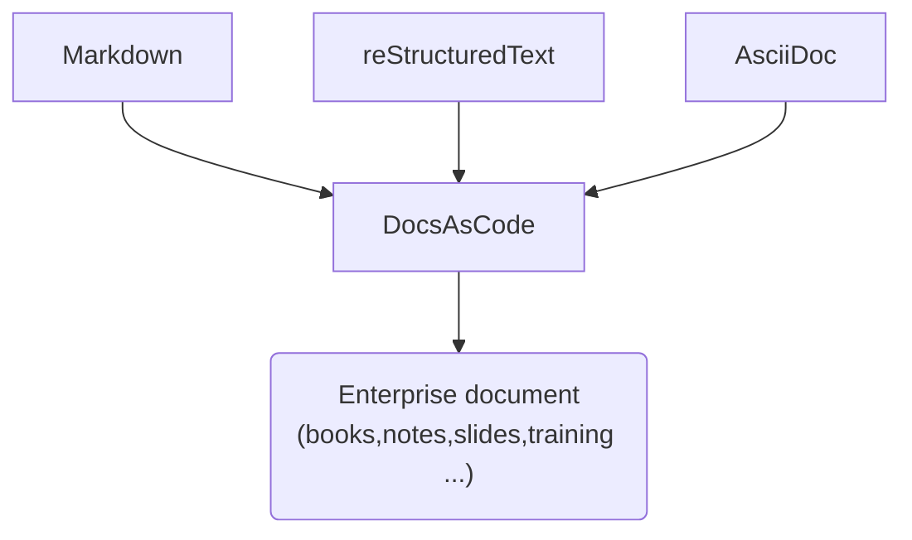

# DocsAsCode

DocsAsCode (DAC) is a collection of tools to help everybody to create professional documents. Everybody loose time with unwanted office suites, loose time to apply corporate identity. With DAC you write the document with your favorite tool in your favorite language, and with a very basic command (or automatic process), you build the definitive document. 

DAC is free and [open source](https://github.com/docascod/DocsAsCode).

## Choose language and tool

With DAC you can write your document in [markdown](md_basic.md), [reStructuredText](rst_basic.md) or [Asciidoctor](asc_basic.md). In next versions we add `odt`, `docx` and `Latex`.

DAC let you choose your best editor to write the document.

## Basic command

DAC offers two basic commands : [build](build.md) and [assemble](assemble.md)

`build` transform your document in one or more definitive documents (pdf, ..)

`assemble` construct a single document composed off several pdf

`build` and `assemble` get only your documents as parameter, no configuration.

## Guiding principles

1. [corporate (or personal) document themes](theme.md) are available into DAC
2. [document's metadata](output.md) indicates one or more theme to use during build
3. [build](build.md) process create one document for each selected theme

Example : you write a book chapter and you want to publish it in a the full book, or to generate a note with watermark to transmit it.

## Under the hood

DAC uses two main tools : [pandoc](https://pandoc.org/) and [asciidoctor](https://asciidoctor.org/)

 `pandoc` converts your document in asciidoctor format.

 `asciidoctor` transforms it in definitive document with selected theme.

DAC adds : some scripts to facilitate communication between tools, and some new features.