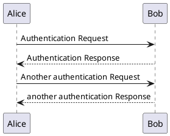
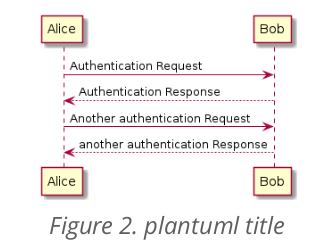
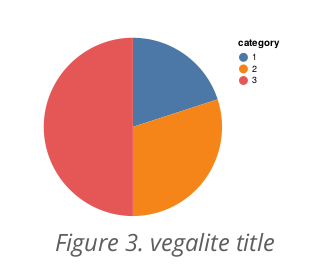
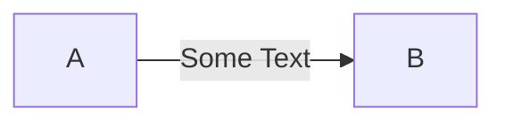
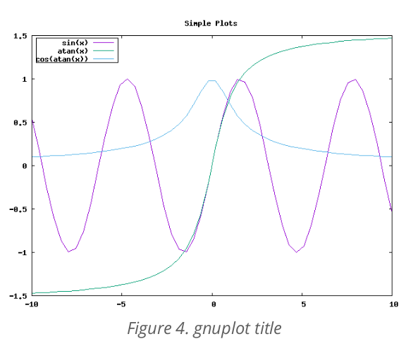

# Diagrams

You can integrate diagram inside your document. Just write diagram description into a code block and DocsAsCode convert it on image in final document !

DocsAsCode supports `PlantUML`, `Vega`, `Vegalite`, `Mermaid` and `Gnuplot`. 

?> You can add a title on your diagram. Just write it in a line before, starting with `.`

## PlantUML

````markdown
.plantuml title


````



## Vegalite

````markdown
.vegalite title

```vega-lite
{
  "$schema": "https://vega.github.io/schema/vega-lite/v4.json",
  "data": {
    "values": [
      {"category": 1, "value": 4},
      {"category": 2, "value": 6},
      {"category": 3, "value": 10}
    ]
  },
  "mark": "arc",
  "encoding": {
    "theta": {"field": "value", "type": "quantitative"},
    "color": {"field": "category", "type": "nominal"}
  },
  "view": {"stroke": null}
}
```
````



## Mermaid

````markdown
.mermaid title


````


## Gnuplot

````markdown
.gnuplot title

```gnuplot
# set terminal pngcairo  transparent enhanced font "arial,10" fontscale 1.0 size 600, 400 
# set output 'simple.1.png'
set key fixed left top vertical Right noreverse enhanced autotitle box lt black linewidth 1.000 dashtype solid
set samples 50, 50
set title "Simple Plots" 
set title  font ",20" textcolor lt -1 norotate
set xrange [ * : * ] noreverse writeback
set x2range [ * : * ] noreverse writeback
set yrange [ * : * ] noreverse writeback
set y2range [ * : * ] noreverse writeback
set zrange [ * : * ] noreverse writeback
set cbrange [ * : * ] noreverse writeback
set rrange [ * : * ] noreverse writeback
NO_ANIMATION = 1
plot [-10:10] sin(x),atan(x),cos(atan(x))
```
````



## External file

Diagram code can be stored in external file.

````markdown
```vegalite
include::diagram.json[]
```
````
